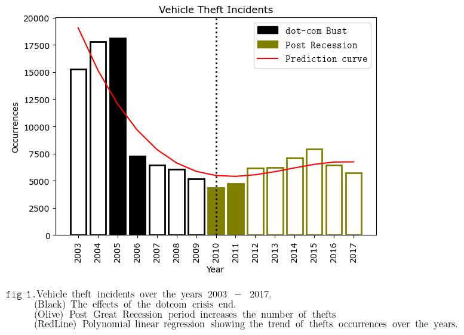

# Introduction

Car theft crimes in San Francisco has fluctuated drastically during the early aughts and mid 2010's. In the early 2000's occurrences of this vehicle related crime was at its highest point. A significant decrease happened from the year 2005 to 2006. A possible explanation could be attributed to the [dot-com bust](https://www.nytimes.com/2001/07/24/business/a-city-takes-a-breath-after-the-dot-com-crash-san-francisco-s-economy-is-slowing.html), a period of massive investment in all kind of tech start-ups which led to a recession period reaching its peak in March 2000. San Francisco was the core of the bust, and the economical difficulties can be reflected in the car theft trend up to 2005. From 2006 this trend continued to decline until 2010 when it started raising again. Even if 2010 is the post recession year this type of spikes remain very difficult to explain and they can be attributed to multiple factors such as new crime & policing policies, immigration patterns, inflation, likelihood of arrests and economic in-equality.  





# Can economic in-equality be a reason for car thefts?

Car thefts in San Francisco reveal many interesting trends for us to explore, whether they are explainable in concrete ways such as tourist spots being the hotspot for theft or trends based on more complicated and abstract workings such as likelihood of arrest versus the severity of punishment.

Investigating the concentration of car theft crime moving from the peak of 2005 to 2006 one of the lowest years can reveal to us some of the story behind why there was such a significant decrease. 2006 begins to feel the effects of equalisation of wealth after the burst of the dot-com bubble, looking into the working-class counties such as Mercede, McLaren, Bayview and Sunset we can visually see more concentrations of car thefts than when we compare a year later in 2006. These are areas worth comparing because they are significantly more residential, and less likely to attract tourism which would skew the data (as we see in the central parts of the city), as tourists are more likely to leave valuables in cars, or have more obvious cars to target such as rental cars. So, a year later we see that these suburbs have a reduced concentration of car thefts occurring, does this allow us to say that bringing forward better equality of wealth reduces crime?

<figure>
  <iframe width="100%" height="500" src="heatmap.html"></iframe>
  <figcaption>Fig 2. - Heatmap of car theft occurences every month (2004-2007) overlayed with median household income of San Francisco counties from the ACS census.</figcaption>
</figure>

Looking at another significant economic event the “Great Recession” which begun at the end of 2007 and officially ended in the middle of 2009, the rate of car theft again begins rising as the US begins to recover economically. Once again looking at the residential working-class suburbs in the middle of 2010 you can see the density increase in amount of thefts in those areas from that period till the peak in our data of 2015. Why would the economic recovery lead to higher crime? During that period the (http://www.bayareaeconomy.org/wp-content/uploads/2021/03/Income-Inequality_3.10.21.pdf)[top 10% highest-earning households income grew by 51% more than the bottom 10% of households]. Which means the disparity of wealth once again widened, potentially being an explanation for these trends, but it is important to note economics can be one of the many machines driving fluctuations in crime.

It is worth addressing that auto burglaries have become far more effective, due to being able to more quickly and efficiently offload stolen goods, with the rise of online trading platforms like eBay. Additionally, the rise of consumer electronics such as tablets, laptops, mobile phones and GPS devices which are often left in cars made smash-and-grabs increasingly more profitable. With this rise came more targeted burglaries with thieves using (https://www.nbcbayarea.com/news/local/car-break-ins-tech-devices/3285126/)[devices] (1) to pickup whether a car contains radio emitting devices. This can be an additional explanation to the rising trend we begin to see occurring from 2011 and onwards.


## Header 2

> This is a blockquote following a header.
>
> When something is important enough, you do it even if the odds are not in your favor.

### Header 3

```js
// Javascript code with syntax highlighting.
var fun = function lang(l) {
  dateformat.i18n = require('./lang/' + l)
  return true;
}
```

```ruby
# Ruby code with syntax highlighting
GitHubPages::Dependencies.gems.each do |gem, version|
  s.add_dependency(gem, "= #{version}")
end
```

#### Header 4

*   This is an unordered list following a header.
*   This is an unordered list following a header.
*   This is an unordered list following a header.

##### Header 5

1.  This is an ordered list following a header.
2.  This is an ordered list following a header.
3.  This is an ordered list following a header.

###### Header 6

| head1        | head two          | three |
|:-------------|:------------------|:------|
| ok           | good swedish fish | nice  |
| out of stock | good and plenty   | nice  |
| ok           | good `oreos`      | hmm   |
| ok           | good `zoute` drop | yumm  |

### There's a horizontal rule below this.

* * *

### Here is an unordered list:

*   Item foo
*   Item bar
*   Item baz
*   Item zip

### And an ordered list:

1.  Item one
1.  Item two
1.  Item three
1.  Item four

### And a nested list:

- level 1 item
  - level 2 item
  - level 2 item
    - level 3 item
    - level 3 item
- level 1 item
  - level 2 item
  - level 2 item
  - level 2 item
- level 1 item
  - level 2 item
  - level 2 item
- level 1 item

### Small image


### Large image


### Definition lists can be used with HTML syntax.

<dl>
<dt>Name</dt>
<dd>Godzilla</dd>
<dt>Born</dt>
<dd>1952</dd>
<dt>Birthplace</dt>
<dd>Japan</dd>
<dt>Color</dt>
<dd>Green</dd>
</dl>

```
Long, single-line code blocks should not wrap. They should horizontally scroll if they are too long. This line should be long enough to demonstrate this.
```

```
The final element.
```
