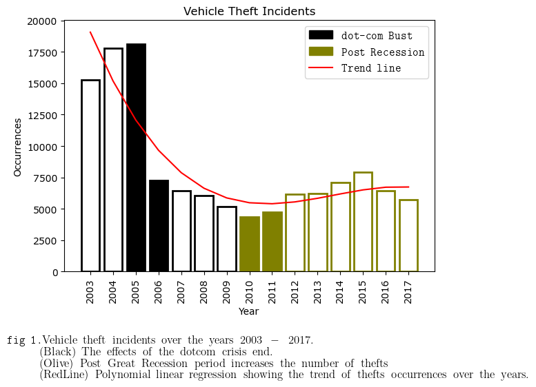

# How interesting can car theft arrests really be?

Can we use what we consider to be mundane and often uninteresting data to explain greater concepts and see the imprint of real world events reflected in it? Let us dive into SFPD's arrest data for car thefts and see what we can explore:  

Car theft crimes in San Francisco has fluctuated drastically during the early aughts and mid 2010's. Analyzing the dataset "[Police Department Incident Reports: Historical 2003 to May 2018](https://data.sfgov.org/Public-Safety/Police-Department-Incident-Reports-Historical-2003/tmnf-yvry/about_data)", it is noticeable that in the early 2000 the occurrences of vehicle related crime were at its highest point. A significant decrease happened from the year 2005 to 2006. A possible explanation could be attributed to the [dot-com bust](https://www.nytimes.com/2001/07/24/business/a-city-takes-a-breath-after-the-dot-com-crash-san-francisco-s-economy-is-slowing.html), a period of massive investment in all kind of tech start-ups which led to a recession period reaching its peak in March 2000. San Francisco was the core of the bust, and the economical difficulties can be reflected in the car theft trend up to 2005. From 2006 this trend continued to decline until 2010 when it started raising again. Even if 2010 is the post recession year this type of spikes remain very difficult to explain and they can be attributed to multiple factors such as new crime & policing policies, immigration patterns, inflation, likelihood of arrests and economic in-equality.  

# Can economic in-equality be a reason for car thefts?

Car thefts in San Francisco reveal many interesting trends for us to explore, whether they are explainable in concrete ways such as tourist spots being the hotspot for theft or trends based on more complicated and abstract workings such as likelihood of arrest versus the severity of punishment.

Investigating the concentration of car theft crime moving from the peak of 2005 to 2006 one of the lowest years can reveal to us some of the story behind why there was such a significant decrease. 2006 begins to feel the effects of equalisation of wealth after the burst of the dot-com bubble, looking into the working-class counties such as Mercede, McLaren, Bayview and Sunset we can visually see more concentrations of car thefts than when we compare a year later in 2006. These are areas worth comparing because they are significantly more residential, and less likely to attract tourism which would skew the data (as we see in the central parts of the city), as tourists are more likely to leave valuables in cars, or have more obvious cars to target such as rental cars. So, a year later we see that these suburbs have a reduced concentration of car thefts occurring, does this allow us to say that bringing forward better equality of wealth reduces crime?

<figure>
  <iframe width="100%" height="500" src="heatmap.html"></iframe>
  <figcaption>Fig 2. - Heatmap of car theft occurences every month (2004-2007) overlayed with median household income of San Francisco counties from the ACS census.</figcaption>
</figure>

Looking at another significant economic event the “Great Recession” which began at the end of 2007 and officially ended in the middle of 2009, the rate of car theft again begins rising as the US begins to recover economically. Once again looking at the residential working-class suburbs in the middle of 2010 you can see the density increase in amount of thefts in those areas from that period till the peak in our data of 2015. Why would the economic recovery lead to higher crime? During that period the [top 10% highest-earning households income grew by 51% more than the bottom 10% of households](http://www.bayareaeconomy.org/wp-content/uploads/2021/03/Income-Inequality_3.10.21.pdf). Which means the disparity of wealth once again widened, potentially being an explanation for these trends, but it is important to note economics can be one of the many machines driving fluctuations in crime.

It is worth addressing that auto burglaries have become far more effective, due to being able to more quickly and efficiently offload stolen goods, with the rise of online trading platforms like eBay. Additionally, the rise of consumer electronics such as tablets, laptops, mobile phones and GPS devices which are often left in cars made smash-and-grabs increasingly more profitable. With this rise came more targeted burglaries with thieves using [devices](https://www.nbcbayarea.com/news/local/car-break-ins-tech-devices/3285126/) to pickup whether a car contains radio emitting devices. This can be an additional explanation to the rising trend we begin to see occurring from 2011 and onwards.

# Investigating other factors that may explain the fluctuations of vehicle theft crime.

In 2009 San Francisco changed the way they conducted policing by decentralising investigation units and established an approach of [community policing](https://medium.com/@juliepitta/a-missed-chance-for-community-police-cooperation-a2c652a8c8b5). Due to these changes in policing approach the department became ineffective in curbing theft crimes in the city, making vehicle theft crimes become [low risk and high reward for thieves](https://www.sfchronicle.com/bayarea/article/car-break-in-oakland-18283842.php). 

<figure>
  <iframe width="100%" height="600" src="timeline.html"></iframe>
  <figcaption>Fig 3. - Interactive timeline showcasing the trend over the years of all theft related crime, car theft and drug related crimes,</figcaption>
</figure>

This gives us a new way to view our dataset, by looking at arrests for vehicle theft and comparing it to the sum of all theft related crimes (excluding vehicle thefts) to see whether the community policing changes could explain the decrease we see in 2009, not as a decrease in crime occurrences but rather number of arrests decreasing. We can see from the two trend lines, the sum of theft crimes follows similar movement to vehicle thefts, suggesting that there may be some merit in policing changes reducing the likelihood of assailants being arrested. Then why to the figures start growing increasingly from 2011 onwards? Is it because the number of crimes started rising due to how low-risk it was, or did San Francisco PD get better at catching thefts or working within their new de-centralised models? This is why it is not wise to extrapolate reasons from singular datasets, it can however guide us into discussions or into what areas should be investigated.

Investigating this data is not only interesting, but it can also lead us into understanding how we can better fix societal issues at the root cause rather than resulting to reactionary measures. Before we conclude comparing trends, we will dive into one more topic to see whether increasing drug usage in San Francisco can explain rising vehicle thefts and general thefts post 2009. 
Increases in [drug usage are often tied with increasing amounts of theft](https://www.ncbi.nlm.nih.gov/pmc/articles/PMC4070162/), and San Francisco has unfortunately being going through a [rising epidemic of opioid usage, overdoses and deaths](https://www.nytimes.com/2024/01/31/upshot/san-francisco-drug-crisis.html). From 2010 to 2012 the curve was flat according to the NY Times, where we also see a flattening of arrests before the gradual climb again. Potentially providing some evidence that indeed the arrests correlate to the number of crimes. 2013 onwards the unjoining of drug and theft trend lines begins to grow, which begs the question based on our assumption wouldn’t these two be tied together? According to the Times article, overdose deaths continue to skyrocket from 2014, so if there are continually more drug users then we could assume we would see more arrests for drug offences. It can be a possibility that criminals are more desperately turning to theft to fund drug habits, and therefore more likely to be arrested for theft related crimes, which would explain the disjoint between arrests for theft and drug charges.

